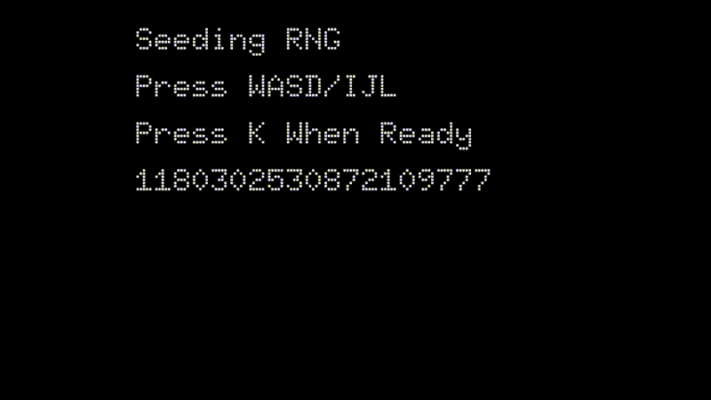

# Subway Sprigsters

> "But can it run DOOM?"
> "No, but it can run Subway Sprigsters"

This project is the realization of a simple dream --
3D graphics on Hack Club's [Sprig](https://sprig.hackclub.com/).

But wait, [ROOM](https://sprig.hackclub.com/gallery/ROOM),
the sister project of Subway Sprigsters has already achieved this!
Yes, but it doesn't run on the real deal.
Subway Sprigsters runs on actual hardware, and it's actually playable!

## Gameplay



```
 ____                 __
/\  _`\              /\ \
\ \,\L\_\    __  __  \ \ \____   __  __  __     __      __  __
 \/_\__ \   /\ \/\ \  \ \ '__`\ /\ \/\ \/\ \  /'__`\   /\ \/\ \
   /\ \L\ \ \ \ \_\ \  \ \ \L\ \\ \ \_/ \_/ \/\ \L\.\_ \ \ \_\ \
   \ `\____\ \ \____/   \ \_,__/ \ \___x___/'\ \__/.\_\ \/`____ \
    \/_____/  \/___/     \/___/   \/__//__/   \/__/\/_/  `/___/> \
                                                            /\___/
                                                            \/__/
 ____                                                 __
/\  _`\                      __                      /\ \__
\ \,\L\_\    _____    _ __  /\_\      __       ____  \ \ ,_\     __    _ __    ____
 \/_\__ \   /\ '__`\ /\`'__\\/\ \   /'_ `\    /',__\  \ \ \/   /'__`\ /\`'__\ /',__\
   /\ \L\ \ \ \ \L\ \\ \ \/  \ \ \ /\ \L\ \  /\__, `\  \ \ \_ /\  __/ \ \ \/ /\__, `\
   \ `\____\ \ \ ,__/ \ \_\   \ \_\\ \____ \ \/\____/   \ \__\\ \____\ \ \_\ \/\____/
    \/_____/  \ \ \/   \/_/    \/_/ \/___L\ \ \/___/     \/__/ \/____/  \/_/  \/___/
               \ \_\                  /\____/
                \/_/                  \_/__/

    /   w   [oooo]   i   \
    \ a s d [oooo] j k l /

    w =              i = Jump
    s = Go Left      j = Go Left
    d = Go Right     l = Go Right
    a =              k = Roll
```

## Playing

### On the Web

[https://davnotdev.github.io/subway_sprigsters](https://davnotdev.github.io/subway_sprigsters)

### From UF2

Download the UF2 from the [latest release](https://github.com/davnotdev/subway_sprigsters/releases).

From here, hold the bootsel button on your sprig while plugging it into your computer.
Then release.
Now, copy the UF2 file into the newly mounted drive.
Voilà.
Have fun!

### From Local PC Build

1. Install Rust from [https://rustup.rs](https://rustup.rs)

2. Install Dependencies

I believe installing the SDL2 library will do.

3. Play

```sh
cargo r
```

### From Local Sprig Build

1. Install Rust from [https://rustup.rs](https://rustup.rs)

2. Install Dependencies

```sh
rustup target add thumbv6m-none-eabi
cargo install cargo-binutils
rustup component add llvm-tools-preview
cargo install elf2uf2-rs
cargo install probe-run
cargo install flip-link
```

3. Compile into UF2

> You MUST build with release.
> Otherwise, the game will take many minutes to boot.

```sh
cargo build-uf2 --release --target thumbv6m-none-eabi
```

4. Install onto Sprig

From here, hold the bootsel button on your sprig while plugging it into your computer.
Then release.
Now, copy the UF2 file from `target/thumbv6m-none-eabi/release/` into the newly mounted drive.
Voilà.
Have fun!
